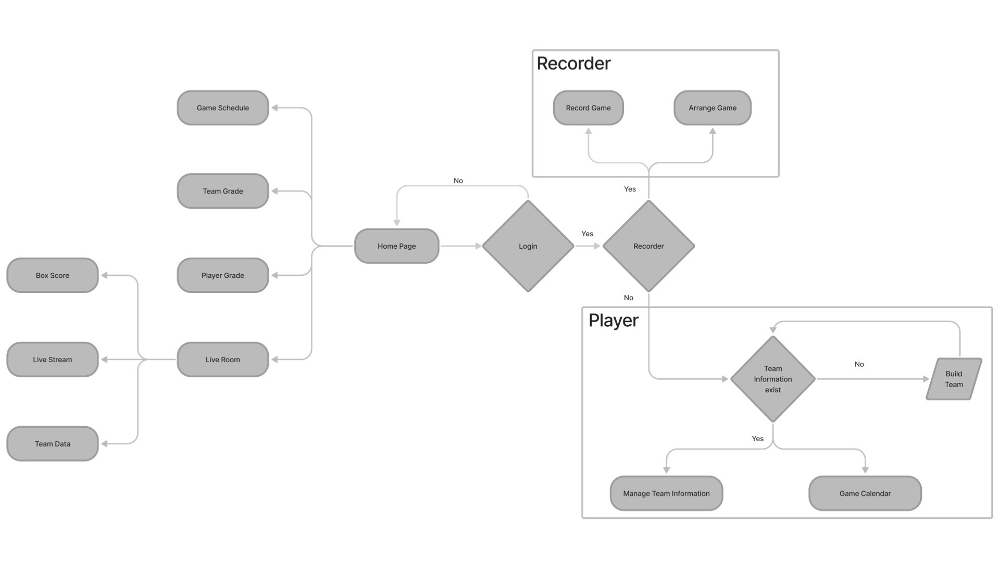
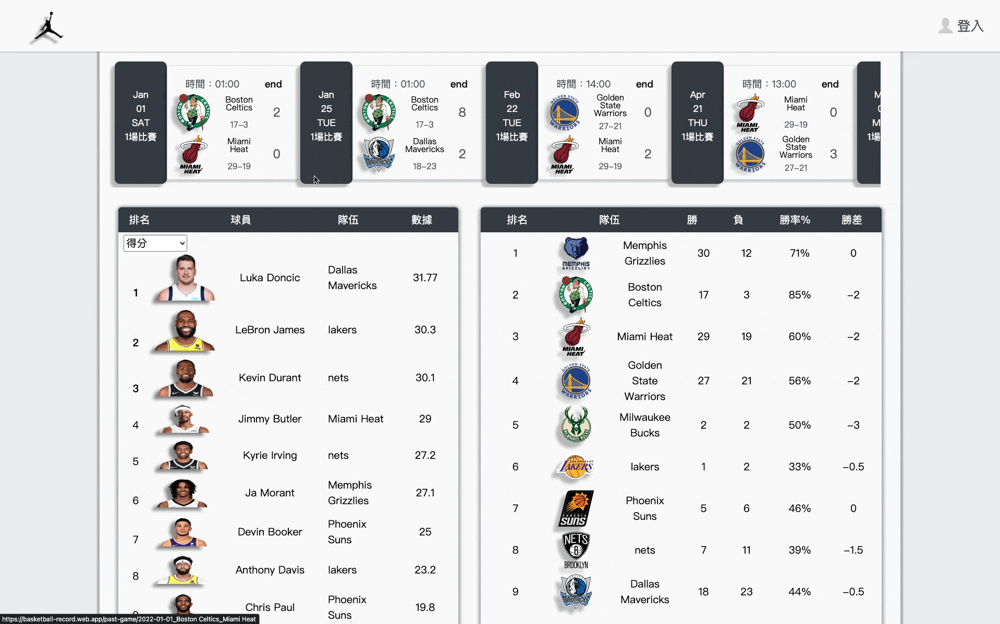
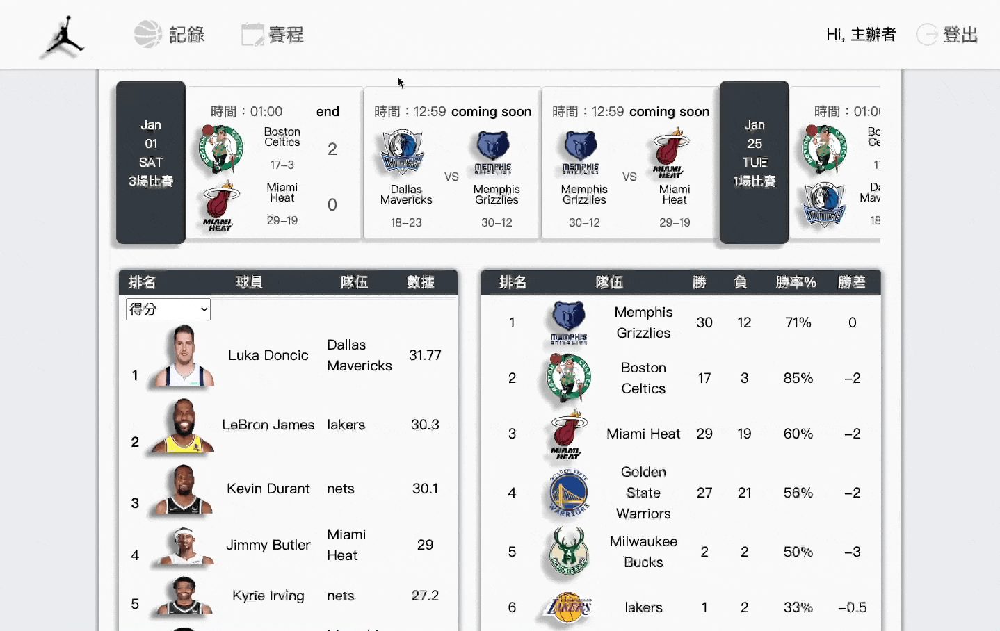
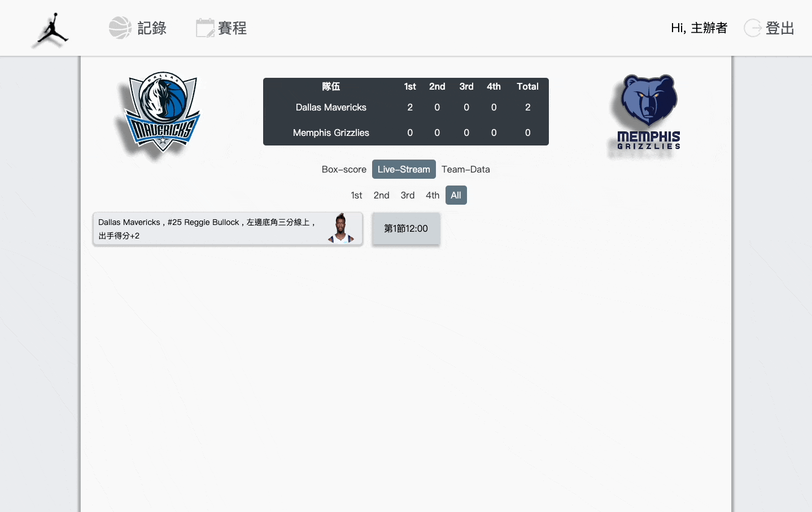
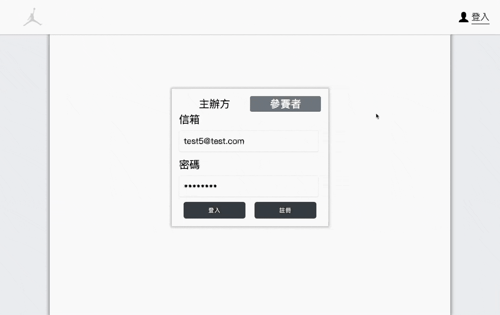

# Basketball Record

## Intro

An interactive basketball game record website, allow users to record basketball game information like video game
operation and show literal Livestream immediately, arrange the games schedule, organize team, and record grades.

## Link

https://basketball-record.web.app/

## Tech

- Applied DOM (mouse event), SVG, and Canvas to record players’ locations.
- Applied DOM (keyboards event) for recording players’ actions.
- Applied react-beautiful-dnd to create a better UX when exchanging players.
- Applied Firebase Services:
  - Authentication for members management.
  - Hosting for website hosting.
  - Firebase and Storage for team and players’ data storage.
- Applied React / React Router for SPA.
- Applied ESLint, and PropTypes for code quality and type checking.
- Applied Responsive Web Design to Adjust website for different screen sizes.

## Flow chart

## Test Account

| Recorder |               |
| -------- | :-----------: |
| Account  | test@test.com |
| password |   testtest    |

| Player   |                |
| -------- | :------------: |
| Account  | test2@test.com |
| password |    testtest    |

## Demo(gif)

## Future Features

- Add each players every game results.
- Add each players shooting location and hit rate.
- Add Contest season feture.

## Contact

e-mail:jazz19910320@gmail.com
